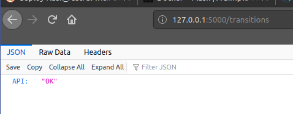

OBS: Para versão em portugues, [clique aqui](README_ptBR.md)
disclaimer: .env 
# Deploy Watcher

Flask RESTFul API that can be integrated into your deployment pipeline to track deployment times.

## Installation

### Local
To run locally on your computer, you must have the following requirements installed:
1. Python version 3.6+
2. Packages listed in requirements_local.txt with the command `pip install -r requirements_local.txt`
3. Git, just to clone the repository. Alternatively, you can download the .zip from that repository and extract it,
ignoring the first command in the instructions below.

If these requirements are met, open your command line and perform the following commands:
#### Windows cmd / Powershell
    git clone https://github.com/automa7/deployWatcher.git
    cd deployWatcher
    flask run
    
#### Linux shell
    git clone https://github.com/automa7/deployWatcher.git
    cd deployWatcher
    flask run

### Docker
#### Dev
To deploy the app in development mode, you will first need to have the following requirements installed in your
computer:
1. Python 3.6+
2. Docker
3. Git, just to clone the repository. Alternatively, you can download the .zip from that repository and extract it,
ignoring the first command in the instructions below.

With these requirements installed and functional on your computer, simply open a command prompt and run the following
commands:

    git clone https://github.com/automa7/deployWatcher.git
    cd deployWatcher
    docker build. -t deploywatcher
    docker run -d -p 5000:5000 deploywatcher

#### Prod
A simulation environment was created for production, where the application is integrated with an http host (nginx + 
uwsgi) and a MySQL database via docker.

Some considerations to be made: as it is intended only as a demonstration of the application's flexibility in any 
environment, no layers of security or scalability were added, but they must be applied when deploying to a real 
production environment.

Prerequisites for installing this environment:
1. Docker (linux host)
2. Docker-compose or Docker-Stack
3. Git, just to clone the repository. Alternatively, you can download the .zip from that repository and extract it,
ignoring the first command in the instructions below.

Having these requirements installed, open a command prompt for your operating system and run the following commands:
NOTE: replace the `docker-compose commands with` `docker stack deploy --compose-file docker-compose.yml`

    git clone https://github.com/automa7/deployWatcher.git
    cd deployWatcher/prod_simulation
    docker-compose build
    docker-compose up

#### Use
To confirm that the execution was successful, access your browser at https://127.0.0.1:5000/transitions. A
message indicating API: OK should appear on the screen, as in the example below:

* Commands
    * GET: returns JSON with message {"API": "OK"}
    * POST: inserts a deployment status into the database. Returns message stating that the insertion was successful 
    and the id of the insertion. Accepts JSON body, containing parameters:
        * component: String => Contains the name of the component being registered
        * version: Decimal(2,1) => Indicates the version of the component that is deploying.
        * author: String => Indicates the person responsible for deploying the component.
        * status: String => Indicates the status of the deployment transition being logged.
        * sent_timestamp: String => Optional parameter in "yyyy-mm-dd hh: mm: ss.fff" format which is converted to 
        datetime for insertion into the database.
        
Example of a post command using the curl tool:

    curl --header "Content-Type: application / json" \
      --request POST \
      --data '{"component": "testApp", "version": 1.0, "author": "automa7", "status": "started", "sent_timestamp": "2020-01-01 10: 10: 50.555 "} '\
      http://127.0.0.1:5000/transitions

## Considerations
The following assumptions are considered for the execution and development of this software:
* The core system must remain agnostic to cloud providers and databases, thus allowing flexibility in
their integration.
* The RESTful Standard will be respected.
* The inputs will be handled by the original system. This is assumed so that there is flexibility in
translation of the data to the API.
* The Local and Dev environments do not take data persistence into account, and were created only to provide a
easy development environment.